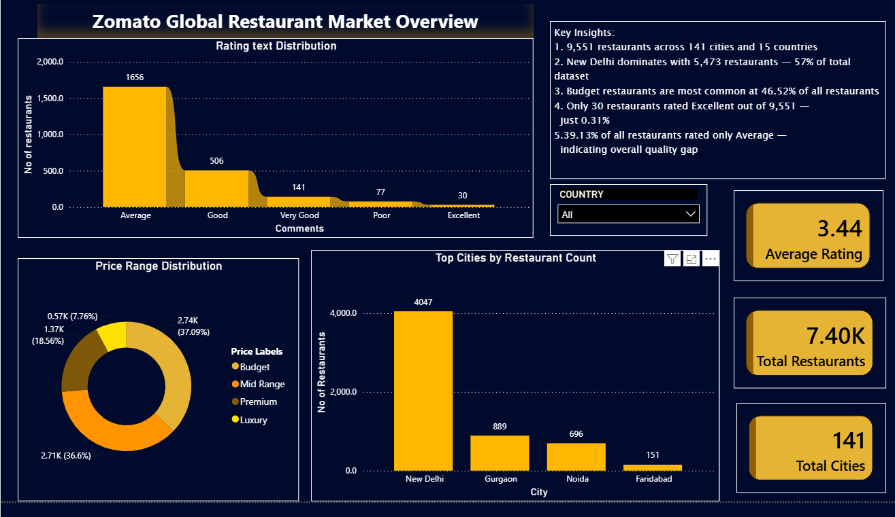
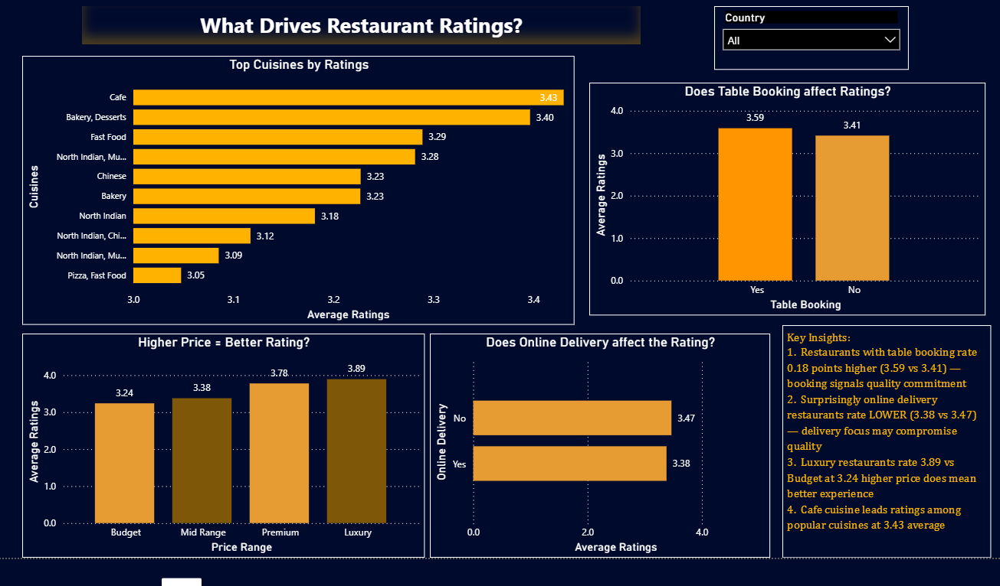
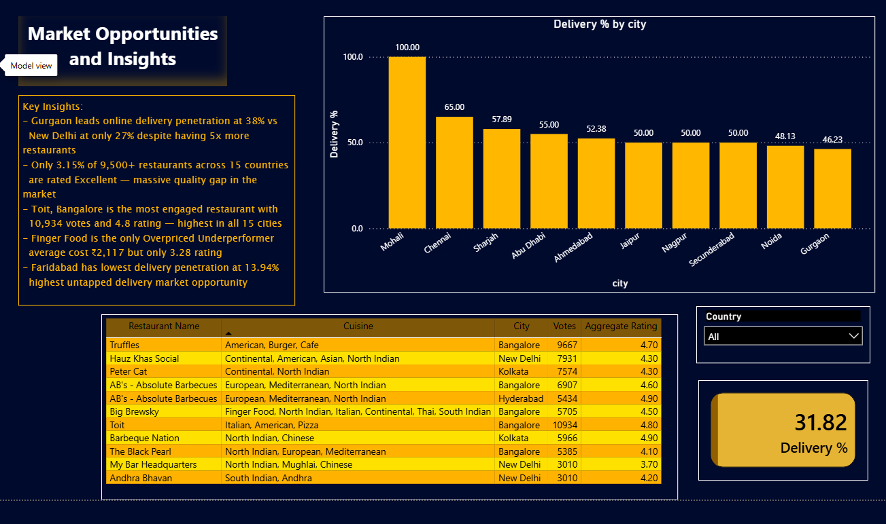

# Zomato Global Restaurant Market Analysis

An end-to-end analysis of 9,551 restaurants across 15 countries and 141 cities — from raw data, through 20 SQL queries (including CTEs and window functions), to a 3-page interactive Power BI dashboard.

---

## Problem

Restaurant platforms and market analysts need to understand what actually drives ratings and delivery adoption — price, cuisine, city, table booking, delivery — to guide expansion and partner strategy, rather than relying on assumptions.

---

## Objective

Query the raw Zomato dataset in PostgreSQL to answer structured business questions, then visualize the results in Power BI as a decision-ready market overview.

---

## Dataset

9,551 restaurants, 21 fields — Restaurant ID, Name, Country Code, City, Address, Cuisines, Average Cost for Two, Currency, Table Booking, Online Delivery, Price Range, Aggregate Rating, Rating Text, Votes. A separate `Country-Code.xlsx` lookup table maps country codes to country names.

---

## Process

- Loaded the raw CSV into PostgreSQL via `COPY`, with a defined schema and primary key
- Wrote 20 SQL queries progressing from simple counts to CTEs and window functions
- Used `CASE` statements to build custom business categories directly in SQL (e.g., "Overpriced Underperformer," "Hidden Gem," "High Engagement Low Satisfaction")
- Exported cleaned/aggregated results and built a 3-page Power BI dashboard: **Market Overview**, **Ratings Drivers**, and **Market Opportunities**
- Added a country slicer for interactive filtering across all three pages

---

## Key SQL Techniques Used

| Technique | Functions Used |
|---|---|
| Aggregation | `COUNT()`, `AVG()`, `SUM()`, `ROUND()` |
| Grouping & Filtering | `GROUP BY`, `HAVING`, `WHERE` |
| Window Functions | `DENSE_RANK()`, `ROW_NUMBER() PARTITION BY`, `SUM() OVER()` |
| CTEs | Multi-step queries (e.g., city cost comparison against overall average) |
| Conditional Logic | `CASE WHEN` for custom categorization |
| Joins | `CROSS JOIN` (city average vs. overall average comparison) |

---

## Business Questions Answered

- **Market Structure** — total restaurants/cities/countries, top cities by restaurant count, most common cuisines
- **Quality & Ratings** — average rating by city, rating distribution, cuisines with highest ratings
- **Pricing** — price range analysis, cities with highest average cost, cost vs. rating value analysis
- **Service Features** — table booking and online delivery impact on ratings, delivery penetration by city
- **Advanced Segmentation** — cities ranked by rating, best-rated restaurant per price tier, value-for-money cuisine categorization, high-engagement-low-satisfaction city detection

---

## Featured Query — Value-for-Money Segmentation

Classifies cuisines into business-relevant categories using nested `CASE` logic on aggregated cost and rating:

```sql
SELECT cuisines,
    ROUND(AVG(average_cost_for_two), 2) AS avg_cost,
    ROUND(AVG(aggregate_rating), 2) AS avg_rating,
    COUNT(*) AS total_restaurants,
    CASE
        WHEN AVG(average_cost_for_two) > 1500 AND AVG(aggregate_rating) < 3.5
            THEN 'Overpriced Underperformer'
        WHEN AVG(average_cost_for_two) < 500 AND AVG(aggregate_rating) > 4.0
            THEN 'Hidden Gem'
        WHEN AVG(average_cost_for_two) > 1500 AND AVG(aggregate_rating) > 4.0
            THEN 'Premium Worth It'
        ELSE 'Average'
    END AS value_category
FROM zomato
WHERE aggregate_rating > 0 AND cuisines IS NOT NULL
GROUP BY cuisines
HAVING COUNT(*) > 30
ORDER BY avg_rating DESC;
```

---

## Dashboard Preview

### Market Overview


### What Drives Ratings


### Market Opportunities


---

## Key Findings

### What Drives Ratings
- Table booking correlates with higher ratings (3.59 vs. 3.41) while, counterintuitively, online delivery correlates with lower ratings (3.38 vs. 3.47) — suggesting delivery-focused operations may trade off dine-in quality
- Price and rating are positively correlated — Luxury restaurants average 3.89 vs. 3.24 for Budget
- Cafe leads among popular cuisines at a 3.43 average rating

### Market Opportunities
- New Delhi dominates the dataset with 4,047+ restaurants (57% of the total) — any market-level conclusion needs to account for this concentration bias
- Only 0.31% of restaurants are rated "Excellent" (30 of 9,551) — a significant quality gap, with 39% rated only "Average"
- "Finger Food" stands out as an Overpriced Underperformer (₹2,117 avg cost, 3.28 rating)
- Gurgaon leads delivery adoption at 38% vs. New Delhi's 27%, despite New Delhi having 5x more restaurants — a clear market opportunity gap
- Toit, Bangalore is the most engaged restaurant — 10,934 votes and a 4.8 rating, highest across all 15 cities

> **Note:** Delivery-penetration-by-city figures should be cross-checked against the query output before final publish — a couple of city-level numbers in the dashboard didn't fully reconcile with the underlying chart during review.

---

## Tools

- PostgreSQL
- Power BI Desktop

---

## How to Run

1. Create a PostgreSQL database and run `Project2.sql` to build the schema and load `zomato.csv`
2. Run the 20 queries in order, or jump to any section
3. Open the Power BI file in Power BI Desktop, refresh the data source, and use the Country slicer to filter all three pages

---

## Future Work

- Join `Country-Code.xlsx` directly into the SQL layer instead of just Power BI, so country names appear in query outputs too
- Add a time dimension if order-level timestamps become available
- Build a drillthrough from city to individual restaurant
